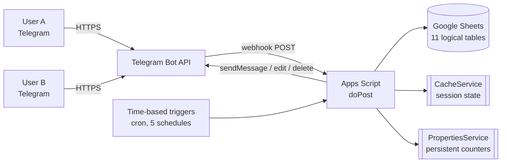
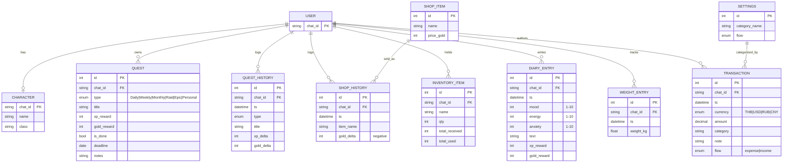
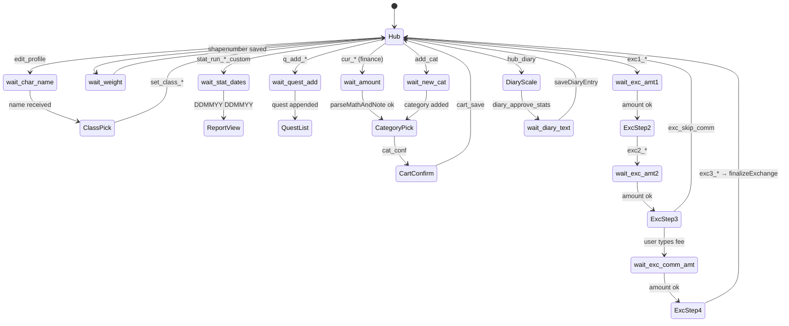
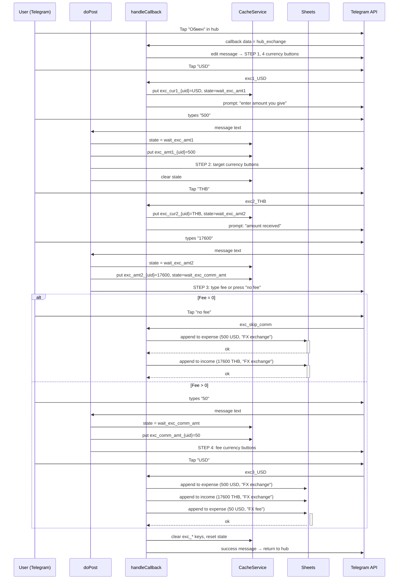

# Architecture — Life Tracking System (Telegram bot on Google Apps Script)

> Technical architecture companion to the case study.
> Source of truth: v44.0 single-file Apps Script backend, 1693 LOC.

---

## 1. System context

The bot is a multi-tenant gamification platform running entirely on Google Workspace. No servers, no containers, no external database.



- **Runtime:** Google Apps Script, V8.
- **Hosting:** Google Workspace. Zero-infra, free tier.
- **Interface:** Telegram Bot API over webhook (no long-polling).
- **Storage:** Google Sheets acts as both OLTP store and admin UI.
- **State:** `CacheService` (in-memory, TTL 10–60 min) for conversation flow; `PropertiesService` (persistent key-value) for counters (day-off left, last-looted level, last-activity timestamps, garbage-collection list).
- **Scheduling:** 5 time-based triggers configured once via `setupAutomationTriggers()`.

---

## 2. Data model (ERD of Google Sheets)

11 logical tables. 4 are shared (family-level financial ledger), 7 are per-user (personal RPG progression) — isolated via suffix `_{chatId}`.



Physical layout in the spreadsheet: the Apps Script runtime resolves each sheet name by `getSh(baseName, chatId) = "{baseName}_{chatId}"` for per-user entities. Shared sheets keep their plain names.

---

## 3. Module map

The monolithic `.gs` file decomposes into the following logical modules (this is the target decomposition applied in `public_repo/`):

```mermaid
flowchart TB
    main[main.gs<br/>doPost + text router]
    tg[telegram.gs<br/>callTelegram, renderMenu, keyboards]
    state[state.gs<br/>CacheService wrappers]
    sheets[sheets.gs<br/>initUserSheets, setup*, buildDashboard]
    rpg[rpg.gs<br/>getRealTimeStats, progress bar, hub, party]
    quests[quests.gs<br/>6 quest types, cart, batch submit]
    dayoff[dayoff.gs<br/>take_dayoff, weekly reset]
    lootbox[lootbox.gs<br/>5-tier rarity + guarantee]
    shop[shop.gs<br/>catalog, cart, checkout]
    inv[inventory.gs<br/>items, use, Indulgence skip]
    diary[diary.gs<br/>3-axis scale, text]
    weight[weight.gs<br/>simple log]
    finance[finance.gs<br/>expense/income cart, parseMathAndNote]
    exchange[exchange.gs<br/>4-step FX flow]
    analytics[analytics.gs<br/>generateAdvancedReport]
    cron[cron.gs<br/>5 time-based triggers]
    heal[autoheal.gs<br/>5 self-healing routines]
    config[config.gs<br/>PropertiesService getters]

    main --> tg
    main --> state
    main --> rpg
    main --> quests
    main --> finance
    main --> exchange
    main --> diary
    main --> weight
    main --> shop
    main --> inv
    main --> analytics
    main --> lootbox
    main --> dayoff
    rpg --> sheets
    quests --> sheets
    shop --> sheets
    inv --> sheets
    diary --> sheets
    weight --> sheets
    finance --> sheets
    exchange --> sheets
    analytics --> sheets
    cron --> quests
    cron --> dayoff
    cron --> analytics
    cron --> tg
    heal --> sheets
    main --> config
    cron --> config
    tg --> config
```



All modules share exactly three runtime dependencies: `SpreadsheetApp`, `CacheService`, and `UrlFetchApp.fetch()` (the last one encapsulated in `telegram.gs → callTelegram`).

---

## 4. Conversation state machine

The bot uses named wait-states persisted in `CacheService`. Each text message from the user is dispatched by looking up the current state of `chatId`. Callback buttons either set a new state or perform an action directly.



State transitions that leave `wait_*` always pass through `resetState(chatId)`, which:
1. Deletes any lingering prompt messages from the chat (UI hygiene).
2. Clears all cache keys with the `chatId` suffix.

**Why cache and not a state column in Sheets?** Sub-second reads. `CacheService` is in-memory, ~1 ms vs. ~100–400 ms for `getRange().getValue()`.

---

## 5. Cron schedule

Five time-based triggers are registered once via `setupAutomationTriggers()` (line 1226 in the original `.gs`).

| Cadence | Function | Responsibility |
|---|---|---|
| Daily 00:00 (TIMEZONE) | `resetQuestsRoutine` | Uncheck dailies; weeklies on Mondays; monthlies on day 1. Write `Штраф` (penalty) −1 XP / −1 gold per undone daily **unless** a day-off was active the previous day. |
| Daily 09:00 | `sendReminders` | Summary message: overdue deadlines, pending dailies/weeklies/monthlies, diary reminder. **Silent** when everything is done (anti-spam contract). |
| Daily 14:00 | `sendReminders` | Same as 09:00. |
| Mondays 10:00 | `weeklyNewspaper` | 7-day digest + **Resilience bonus** (+125 XP / +100 gold for 2/2 unused day-offs, +62/+50 for 1/2). Resets day-off counter to 2. |
| Every 15 minutes | `universalGarbageCollector` | (1) delete messages in `gc_list` older than 1 hour; (2) force-return to hub if `last_active > 30 min` and current menu ≠ hub. |

**Observability note:** none of the triggers emit structured logs. In the Python rewrite this is one of the first things to fix (structlog + metric on silent paths).

---

## 6. Sequence: 4-step currency exchange

The most non-trivial conversation flow in the bot. Why it is four steps: you type an amount in *source* currency, but after conversion you only *know* the amount that landed in *target* currency (rate + fees + rounding). Plus, fees can come in a currency different from both sides.



**Invariant:** exchange rows in both ledgers carry category `"🔄 Обмен валют"`. The analytics module (`generateAdvancedReport`) filters them into a dedicated `excStats` block so they never pollute "clean expense/income" totals.

**Failure mode.** The flow is a sequence of `appendRow` calls. If the script crashes (hitting a 6-minute quota or a transient Sheets 500) between rows, the ledger ends up inconsistent (e.g. expense written, income missing). A cron validator fixing this on a schedule is the current informal mitigation; PostgreSQL transactions will make it vanish post-migration.

---

## 7. Real-time player stats — the hot path

`getRealTimeStats(chatId)` reads three sheets on every hub tap to compute level, current XP, and gold. Then level is derived by iterating exponential thresholds.

```
xp, gold = 0
xp  += SUM(Diary_{uid}.G) + SUM(Diary_{uid}.H)            # 2 columns, 1 getRange
xp  += SUM(QuestHist_{uid}.E) + SUM(QuestHist_{uid}.F)    # 2 columns, 1 getRange
gold+= SUM(ShopHist_{uid}.C)                              # 1 column, 1 getRange

# Exponential progression
lvl, nextGoal, passedXp, K = 1, 1000, 0, 1.2
while xp >= passedXp + nextGoal:
    passedXp += nextGoal
    lvl      += 1
    nextGoal  = floor(nextGoal * K)

curXp = xp - passedXp
```

Level thresholds: L2 = 1 000, L3 = +1 200, L4 = +1 440, L5 = +1 728, L6 = +2 073, L7 = +2 487 XP.

**This function is the bot's performance hot-spot.** Any hub open, any quest submission, any shop/party screen calls it. For the `general` report it is called *again* at the end. On two active users the Apps Script execution-time trace plateaued at hundreds of ms per hub open — the primary reason the project is migrating to a proper database with a materialised `Character.current_*` snapshot table.

---

## 8. Security & tenancy boundaries

- Hard whitelist in two places: `doPost` (text path, line 37) and `handleCallback` (callback path, line 193). Both compare `chatId` against `ALLOWED_USERS`. Everything else is explicit early-return.
- Per-user sheets use `chatId` as suffix → row-level isolation by construction. No query can accidentally mix two users' progressions because the sheet name itself is scoped.
- Shared sheets (ledger, settings, shop) are the **explicit** family boundary, not a leak.
- In `public_repo/` the whitelist moves to `PropertiesService` and the suffix scheme is documented. For production the right pattern is a proper `users` table with a foreign-key discipline; in Apps Script, the sheet-naming convention is the pragmatic equivalent.

---

## 9. Auto-healing layer

Five manual-trigger utility functions (`FIX_MY_SHEET`, `GLOBAL_REFORMER`, `FIX_DEADLINES_FINAL`, `FIX_DROPDOWNS`, `ADD_MISSING_CATEGORIES`) exist to correct drift in the spreadsheet caused by either user edits to the sheet or type coercion quirks of Google Sheets (e.g. a checkbox cell becomes the string `"FALSE"` after paste-as-text). These are specific to the Apps Script / Sheets combo and will be deleted on migration — normalised columns in PostgreSQL remove the class of failure entirely.

---

## 10. Performance budget and quotas (relevant to the migration decision)

| Constraint | Value (Apps Script) | Impact on this bot |
|---|---|---|
| Execution time per invocation | **6 min hard limit** | `generateAdvancedReport("general","year")` approaches the upper half on two users. |
| Concurrent executions per script | effectively serialised | Two active users already queue against each other on hub opens. |
| UrlFetchApp calls / day | 20 000 | Never hit, but chatty UX (delete + edit + send for each tap) keeps this in mind. |
| Cache lifetime | 6 h max | Fine for session state. |
| Properties size | 500 KB script-level | `gc_list` array persisted here is the only real consumer. |

Migration target (Python): P95 hub open < 150 ms, P95 general report < 500 ms, transactional quest submission, horizontal reminder jobs.

---

*End of architecture.md*
